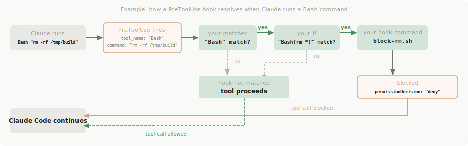

# Hooks

> 원본: [https://code.claude.com/docs/ko/hooks](https://code.claude.com/docs/ko/hooks)

## 기본 개념

- Hook은 Claude Code 세션의 특정 시점에 자동 실행되는 셸 명령, HTTP 엔드포인트, LLM 프롬프트, 에이전트이다.
- 설정 위치: `~/.claude/settings.json`(사용자), `.claude/settings.json`(프로젝트), `.claude/settings.local.json`(로컬), 관리 정책, 플러그인, 컴포넌트 프론트매터
- Hook 타입: `command`, `http`, `prompt`, `agent`

### 라이프사이클


```
SessionStart → InstructionsLoaded → UserPromptSubmit
→ PreToolUse → PermissionRequest → PostToolUse / PostToolUseFailure
→ Notification, CwdChanged, FileChanged, ConfigChange (반응형)
→ SessionEnd
```

### 종료 코드

| 종료 코드 | 동작 |
|-----------|------|
| 0 | 성공. JSON 출력 처리 |
| 2 | 차단 오류. stderr가 사용자/Claude에게 표시 |
| 기타 | 비차단 오류. verbose 모드에서만 표시 |

### Hook 해석 흐름



## 설정 구조

```json
{
  "hooks": {
    "EventName": [
      {
        "matcher": "필터_패턴",
        "hooks": [
          {
            "type": "command|http|prompt|agent",
            "if": "ToolName(pattern)",
            "timeout": 600,
            "statusMessage": "커스텀 메시지"
          }
        ]
      }
    ]
  }
}
```

## 옵션

### 공통 필드

| 옵션 | 설명 | 기본값 |
|------|------|--------|
| `type` | Hook 타입 (`command`, `http`, `prompt`, `agent`) | 필수 |
| `if` | 권한 규칙 구문으로 필터링 (도구 이벤트 전용) | - |
| `timeout` | 취소까지 대기 시간(초) | command: 600, prompt: 30, agent: 60 |
| `statusMessage` | 실행 중 표시할 스피너 메시지 | - |

### Hook 타입별 옵션

**Command Hook**

| 옵션 | 설명 | 기본값 |
|------|------|--------|
| `command` | 실행할 셸 명령 경로 | 필수 |
| `async` | 백그라운드 실행 여부 | false |
| `shell` | 사용할 셸 | `bash` |

**HTTP Hook**

| 옵션 | 설명 | 기본값 |
|------|------|--------|
| `url` | POST 요청 대상 URL | 필수 |
| `headers` | 커스텀 HTTP 헤더 (환경변수 보간 지원) | - |
| `allowedEnvVars` | 헤더에 허용할 환경변수 목록 | - |

**Prompt Hook**

| 옵션 | 설명 | 기본값 |
|------|------|--------|
| `prompt` | LLM에 전달할 프롬프트 | 필수 |
| `model` | 사용할 모델 | - |

**Agent Hook**

| 옵션 | 설명 | 기본값 |
|------|------|--------|
| `prompt` | 서브에이전트에 전달할 프롬프트 | 필수 |
| `model` | 사용할 모델 (`sonnet` 등) | - |

### Matcher 패턴

| 이벤트 | 매칭 대상 | 예시 |
|--------|-----------|------|
| Tool 이벤트 | 도구 이름 | `Bash`, `Edit\|Write`, `mcp__.*` |
| SessionStart | 세션 소스 | `startup`, `resume`, `clear`, `compact` |
| SessionEnd | 종료 사유 | `clear`, `resume`, `logout`, `prompt_input_exit` |
| Notification | 알림 타입 | `permission_prompt`, `idle_prompt` |
| SubagentStart/Stop | 에이전트 타입 | `Bash`, `Explore`, `Plan` |
| ConfigChange | 설정 소스 | `user_settings`, `project_settings`, `local_settings`, `policy_settings`, `skills` |
| FileChanged | 파일명 패턴 | `.envrc`, `.env` |
| StopFailure | 오류 타입 | `rate_limit`, `authentication_failed`, `billing_error` |
| PreCompact/PostCompact | 압축 트리거 | `manual`, `auto` |
| InstructionsLoaded | 로드 사유 | `session_start`, `nested_traversal`, `include`, `path_glob_match`, `compact` |
| Elicitation/ElicitationResult | MCP 서버 이름 | 설정된 MCP 서버명 |

## JSON 입력 형식

모든 이벤트에 공통으로 전달되는 입력 필드:

| 필드 | 설명 |
|------|------|
| `session_id` | 현재 세션 ID |
| `transcript_path` | 대화 기록 파일 경로 |
| `cwd` | 현재 작업 디렉토리 |
| `permission_mode` | 권한 모드 (`default`, `plan`, `acceptEdits`, `auto`, `dontAsk`, `bypassPermissions`) |
| `hook_event_name` | 이벤트 이름 |
| `agent_id` | 서브에이전트 ID (해당 시) |
| `agent_type` | 에이전트 타입 (해당 시) |

### 이벤트별 추가 입력

| 이벤트 | 추가 필드 |
|--------|-----------|
| `PreToolUse` / `PostToolUse` | `tool_name`, `tool_input`, `tool_use_id` |
| `PostToolUseFailure` | `tool_input`, `error`, `is_interrupt` |
| `PermissionRequest` | `tool_name`, `tool_input`, `permission_suggestions` |
| `PermissionDenied` | `tool_name`, `tool_input`, `reason` |
| `UserPromptSubmit` | `prompt` |
| `Stop` / `SubagentStop` | `stop_hook_active`, `last_assistant_message` |
| `SessionStart` | `source`, `model`, `agent_type` |
| `CwdChanged` | `old_cwd`, `new_cwd` |
| `FileChanged` | `file_path`, `event` |
| `TaskCreated` / `TaskCompleted` | `task_id`, `task_subject`, `task_description`, `teammate_name`, `team_name` |
| `InstructionsLoaded` | `file_path`, `memory_type`, `load_reason`, `globs`, `trigger_file_path` |
| `PostToolUse` (추가) | `tool_response` |

## JSON 출력 형식

Hook이 반환할 수 있는 JSON 필드:

| 필드 | 설명 |
|------|------|
| `continue` | `false`이면 Claude 완전 중지 |
| `stopReason` | 중지 사유 |
| `suppressOutput` | 출력 숨기기 |
| `systemMessage` | 사용자에게 표시할 경고 메시지 |
| `decision` | `"block"`으로 도구 호출 차단 |
| `reason` | 차단 사유 |

### PreToolUse 전용 출력

```json
{
  "hookSpecificOutput": {
    "hookEventName": "PreToolUse",
    "permissionDecision": "allow|deny|ask|defer",
    "permissionDecisionReason": "...",
    "updatedInput": { "modified_field": "value" },
    "additionalContext": "..."
  }
}
```

## 주요 이벤트 요약

| 이벤트 | 시점 | 주요 용도 |
|--------|------|-----------|
| `SessionStart` | 세션 시작/재개 | 환경 설정, 컨텍스트 주입 |
| `UserPromptSubmit` | 사용자 입력 처리 전 | 입력 검증, 차단 |
| `PreToolUse` | 도구 실행 전 | 권한 제어, 입력 수정 |
| `PermissionRequest` | 권한 대화상자 표시 전 | 자동 허용/거부, 권한 규칙 추가 |
| `PostToolUse` | 도구 성공 후 | 추가 컨텍스트, MCP 출력 수정 |
| `PostToolUseFailure` | 도구 실패 후 | 오류 피드백 |
| `Stop` | Claude 응답 완료 시 | 중지 방지 (`decision: "block"`) |
| `Notification` | 알림 발생 시 | 컨텍스트 추가 가능 |
| `CwdChanged` | 작업 디렉토리 변경 | 파일 감시 경로 업데이트 |
| `FileChanged` | 감시 파일 수정 | 동적 모니터링 |
| `ConfigChange` | 설정 파일 변경 | 변경 차단 가능 |
| `PermissionDenied` | auto 모드 분류기 거부 시 | 재시도 허용 (`retry: true`) |
| `SubagentStart` | 서브에이전트 생성 시 | 컨텍스트 주입 |
| `SubagentStop` | 서브에이전트 종료 시 | 중지 방지 가능 |
| `StopFailure` | API 오류로 턴 종료 시 | 로깅 전용 |
| `TaskCreated` | 태스크 생성 시 | 생성 차단 가능 |
| `TaskCompleted` | 태스크 완료 시 | 완료 차단 가능 |
| `TeammateIdle` | 팀원 유휴 시 | 유휴 방지 가능 |
| `PreCompact` | 컨텍스트 압축 전 | 관찰 전용 |
| `PostCompact` | 컨텍스트 압축 후 | 관찰 전용 |
| `InstructionsLoaded` | CLAUDE.md/rules 로드 시 | 관찰 전용 |
| `WorktreeCreate` | Git worktree 생성 시 | 경로 반환 |
| `WorktreeRemove` | Git worktree 제거 시 | 관찰 전용 |
| `Elicitation` | MCP 서버 사용자 입력 요청 시 | 자동 응답 가능 |
| `ElicitationResult` | 사용자 응답 시 | 응답 재정의 가능 |
| `SessionEnd` | 세션 종료 | 정리 작업 (timeout 1.5초) |

## 사용 예시

### 위험한 명령 차단 (Command Hook)

```json
{
  "hooks": {
    "PreToolUse": [
      {
        "matcher": "Bash",
        "hooks": [
          {
            "type": "command",
            "command": "/path/to/block-dangerous.sh"
          }
        ]
      }
    ]
  }
}
```

```bash
# block-dangerous.sh
COMMAND=$(jq -r '.tool_input.command')
if echo "$COMMAND" | grep -q 'rm -rf'; then
  echo "Blocked: dangerous command" >&2
  exit 2
fi
exit 0
```

### 파일 저장 후 자동 린트 (PostToolUse)

```json
{
  "hooks": {
    "PostToolUse": [
      {
        "matcher": "Write|Edit",
        "hooks": [
          {
            "type": "command",
            "command": "/path/to/lint.sh"
          }
        ]
      }
    ]
  }
}
```

### direnv 연동 (CwdChanged)

```json
{
  "hooks": {
    "CwdChanged": [
      {
        "hooks": [
          {
            "type": "command",
            "command": "direnv export bash >> $CLAUDE_ENV_FILE"
          }
        ]
      }
    ]
  }
}
```

### 사용자 입력 검증 (UserPromptSubmit)

```json
{
  "hooks": {
    "UserPromptSubmit": [
      {
        "hooks": [
          {
            "type": "command",
            "command": "/path/to/validate-prompt.sh"
          }
        ]
      }
    ]
  }
}
```

```bash
# validate-prompt.sh
PROMPT=$(jq -r '.prompt')
if echo "$PROMPT" | grep -qi 'secret\|password\|credential'; then
  echo "Blocked: 민감 정보가 포함된 프롬프트" >&2
  exit 2
fi
echo '{"additionalContext": "보안 검증 통과"}'
exit 0
```

### 세션 시작 시 환경변수 주입 (SessionStart)

```json
{
  "hooks": {
    "SessionStart": [
      {
        "hooks": [
          {
            "type": "command",
            "command": "echo 'export PROJECT_ENV=production' >> $CLAUDE_ENV_FILE"
          }
        ]
      }
    ]
  }
}
```

### 외부 서비스 알림 (HTTP Hook)

```json
{
  "hooks": {
    "SessionEnd": [
      {
        "hooks": [
          {
            "type": "http",
            "url": "http://localhost:8080/hooks/session-end",
            "headers": {
              "Authorization": "Bearer $HOOK_TOKEN"
            },
            "allowedEnvVars": ["HOOK_TOKEN"]
          }
        ]
      }
    ]
  }
}
```

### 안전성 자동 판단 (Prompt Hook)

```json
{
  "hooks": {
    "PreToolUse": [
      {
        "matcher": "Bash",
        "hooks": [
          {
            "type": "prompt",
            "prompt": "Is this safe? $ARGUMENTS",
            "model": "haiku"
          }
        ]
      }
    ]
  }
}
```

### 도구 실행 권한 자동 허용 (PreToolUse)

```json
{
  "hooks": {
    "PreToolUse": [
      {
        "matcher": "Read|Glob|Grep",
        "hooks": [
          {
            "type": "command",
            "command": "echo '{\"hookSpecificOutput\":{\"permissionDecision\":\"allow\",\"permissionDecisionReason\":\"읽기 전용 도구 자동 허용\"}}'"
          }
        ]
      }
    ]
  }
}
```

### 응답 완료 방지 (Stop)

```json
{
  "hooks": {
    "Stop": [
      {
        "hooks": [
          {
            "type": "command",
            "command": "/path/to/check-completion.sh"
          }
        ]
      }
    ]
  }
}
```

```bash
# check-completion.sh
# decision: "block"을 반환하면 Claude가 멈추지 않고 계속 작업한다
MESSAGE=$(jq -r '.last_assistant_message')
if echo "$MESSAGE" | grep -q 'TODO'; then
  echo '{"decision":"block","reason":"미완료 TODO가 남아있습니다"}'
fi
exit 0
```

### MCP 도구 필터링 (PreToolUse + matcher)

```json
{
  "hooks": {
    "PreToolUse": [
      {
        "matcher": "mcp__slack__.*",
        "hooks": [
          {
            "type": "command",
            "command": "/path/to/approve-slack.sh"
          }
        ]
      }
    ]
  }
}
```

### Skills/Agent에서 Hook 정의

프론트매터에서 동일한 구조로 정의한다. 컴포넌트 라이프사이클에 한정된다.

```yaml
---
name: secure-operations
hooks:
  PreToolUse:
    - matcher: "Bash"
      hooks:
        - type: command
          command: "./scripts/check.sh"
---
```

## 경로 참조 변수

| 변수 | 설명 |
|------|------|
| `$CLAUDE_PROJECT_DIR` | 프로젝트 루트 |
| `${CLAUDE_PLUGIN_ROOT}` | 플러그인 설치 디렉토리 |
| `${CLAUDE_PLUGIN_DATA}` | 플러그인 영속 데이터 디렉토리 |
| `$CLAUDE_ENV_FILE` | 후속 Bash 명령에 환경변수 전달용 파일 (SessionStart, CwdChanged, FileChanged 전용) |
| `$CLAUDE_CODE_REMOTE` | 원격 환경에서 `"true"`, 로컬에서 미설정 |

## Hook 관리

- `/hooks` 명령으로 설정된 Hook을 대화형으로 조회할 수 있다.
- 전체 비활성화: 설정 파일에 `"disableAllHooks": true` 추가 (관리 정책 Hook은 제외).
